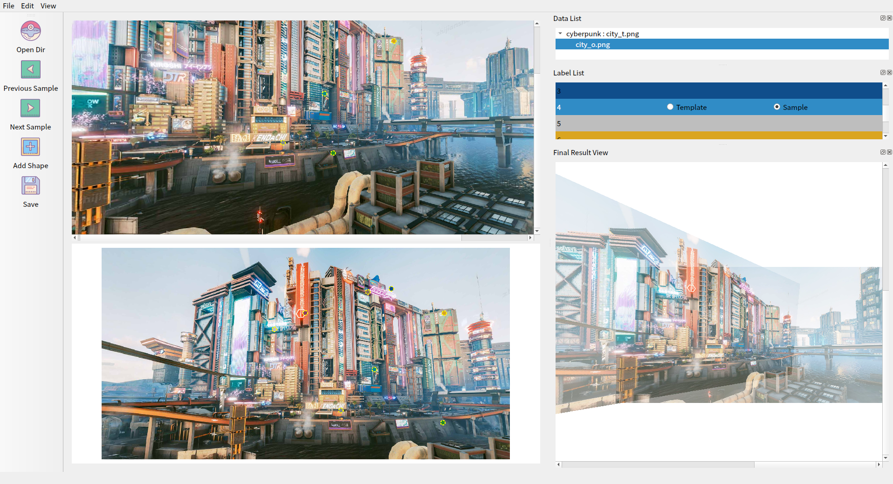

# 说明
一款用来标注图像对之间单应性的简单工具.

# 依赖
- pyqt5
- opencv

# 使用方式
点击`精灵球`,选择图像对数据集所在的文件夹,数据集的组织方式,类似 **HPatchs** 数据集如下:
```
dataset
    |
    |--img_pair_dir_0
    |        |
    |        |--template_img_t.jpg
    |        |--sample0_img.jpg
    |        |--sample1_img.jpg
    |        |     ...
    |        |--samplen_img.jpg
    |
    |--img_pair_dir_1
    |      ...
```
`img_pair_dir`随便啥名称都行,该目录下所有图片都是统一场景,之间存在单应性关系.
**注意目录中图片模板图片的名称需以`_t`结尾**,目前支持jpg,png,bmp,图像后缀名要么都大写,要么都小写.

打开之后,如下图:


上面视窗显示模板图片,下面视窗显示需要进行单应性变换到模板的图片.
单击添加图形,可以在图片视窗中画点,通过两幅图片之间的点的对应关系.最后计算下图到上图的单应性矩阵.点完之后按`Esc`退出绘制模式.然后再进行保存.

保存之后的标签文件为json,大致格式如 [doc/label_file_example.json](doc/label_file_example.json)

默认不开启自动保存,需要手动点击`保存`,或者按`ctrl+s`

# 图片大小调整
按住`ctrl`,鼠标滚轮可以调整图片大小. 单击鼠标滚轮可以缩放图片到合适尺寸.

# 默认快捷键设置
- 上一图片:`a`
- 下一图片:`b`
- 添加图形:`w`
- 保存标签:`ctrl+s`
- 退出绘制模式:`Esc`

# TODO
- [x] 大图片标注优化
- [x] 添加一个结果可视化
- [ ] 多语言支持
- [x] 文件打包
- [x] 优化列表
